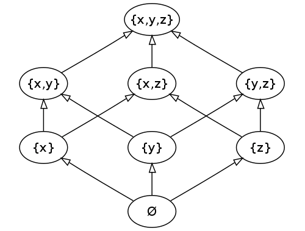
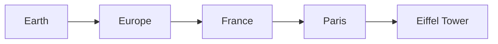
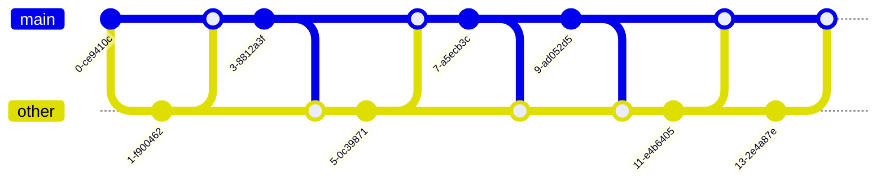

# µgraph: Fast, Untraceable Payments in Cardano

## Table of Contents

1. Abstract
1. Introduction
1. µ
1. License

## Abstract

In this document, we describe **µgraph (mugraph)**, a novel open-source protocol for instant, private payments, built on top of the Cardano Blockchain. It massively increases transaction speed and throughput, with a focus of making real-world payments fast, reliable and accessible, while being private-by-default.

## Introduction

µgraph is our interpretation on how cryptocurrencies could be used to enable real-world payments between people. We think blockchains can be great agents for change, to bring back economic power to the people, but it seems that all the things we do are for ourselves, not for the average Joe.

You can see it easily in the wild, most "real-world" crypto businesses still have to do most or all of their payments in Fiat, and the most proeminent commerce use-cases are usually things related to privacy, like VPNs. For many years now, [Travala](https://travala.com) is probably still the only travel provider selling plane tickets that you can pay using crypto.

ZeroHedge explains this phenomena perfectly, in their article ["What Happened to Bitcoin?"](https://www.zerohedge.com/crypto/what-happened-bitcoin):

> At the same time, new technologies were becoming available that vastly improved the efficiency and availability of exchange in fiat dollars. They included Venmo, Zelle, CashApp, FB payments, and many others besides, in addition to smartphone attachments and iPads that enabled any merchant of any size to process credit cards. These technologies were completely different from Bitcoin because they were permission-based and mediated by financial companies. But to users, they seemed great and their presence in the marketplace crowded out the use case of Bitcoin at the very time that my beloved technology had become an unrecognizable version of itself.

In our point of view, there are five main problems we need to tackle if we want to make crypto widely available for anyone:

1. **Volatility:** Because of their nature as assets (as well as the lack of government price controls), crypto assets are much more volatile than most currencies.
1. **Scalability:** No blockchain today is scalable enough for global payments.
1. **Privacy:** Having to make your own financial identity public just to send a payment is a price that many won't pay.
1. **Ease of Use:** You shouldn't need to read the Bitcoin Paper and watch all of Charles Hoskinson videos just to send and receive payments.

We think that, while there has been at least some very solid attempts at covering volatility, like Stablecoins or Synthetic Assets, the other ones are still ripe for the taking, and we think we can tackle them all by going simpler instead of more complicated, and by making sacrifices only where it makes sense.

## Technical Overview

Distributed systems have for a long time used something called the [CAP Theorem](https://en.wikipedia.org/wiki/CAP_theorem) to describe the guarantees associated with the system. The concept has since received it fair share of expansions and critiques, in special, from very respected authors like Martin Kleppman, in his paper [A critique of the CAP Theorem](https://www.cl.cam.ac.uk/research/dtg/archived/files/publications/public/mk428/cap-critique.pdf).

In it, Kleppman talks a lot about the [Consistency Models](https://en.wikipedia.org/wiki/Consistency_model), which can be thought of a "contract" between the user/developer and a system, stating the certainty of predictability of the [consistency](https://en.wikipedia.org/wiki/Data_consistency) of reads, writes and updates.

> [!IMPORTANT]
> We are going to talk about Byzantine Fault Tolerance (BFT) later in the document.

Those models have been first described on the ["Session Guarantees for Weakly Consistent Replicated Data"](https://www.cs.cornell.edu/courses/cs734/2000FA/cached%20papers/SessionGuaranteesPDIS_1.html) Paper. We are not talking about all of them, but these are some we are interested in:

1. **Monotonic Read Consistency:**

   - User $A$ sends update $\Delta_0$ to node $\alpha$.
   - Then, $A$ reads from node $\beta$ and reads $\Delta_1$.
   - A system has this property if $\Delta_0 \leq \Delta_1$.

1. **Monotonic Write Consistency:**

   - User $B$ writes $\Delta_0$ to node $\gamma$.
   - Then, $B$ writes $\Delta_1$ to node $\delta$.
   - A system has this property if the writes are observed in the order $\Delta_0 \rightarrow \Delta_1$.

1. **Read-Your-Writes Consistency:**

   - User $C$ writes $\Delta_0$ to node $\epsilon$.
   - Then, $C$ reads from node $\zeta$ and should see $\Delta_0$ or a more recent value.

1. **Write-Follows-Reads Consistency:**

   - User $D$ reads $\Delta_0$ from node $\eta$.
   - Then, $D$ writes $\Delta_1$ to node $\theta$.
   - A system has this property if $\Delta_1$ is based on $\Delta_0$ and respects the order of the reads and writes.

1. **Strong Consistency:**

   - User $E$ writes $\Delta_0$ to node $\iota$.
   - User $F$ reads from node $\kappa$ immediately after.
   - In a strongly consistent system, $F$ will see $\Delta_0$ without any delay.

1. **Sequential Consistency:**

   - User $G$ writes $\Delta_0$ to node $\lambda$.
   - User $H$ writes $\Delta_1$ to node $\mu$.
   - Users reading from any node will see the writes in the same order, but not necessarily in the real-time order.

1. **Causal Consistency:**

   - User $I$ writes $\Delta_0$ to node $\nu$.
   - User $J$ reads $\Delta_0$ from node $\xi$ and writes $\Delta_1$ to node $\pi$.
   - All users must see $\Delta_0$ before $\Delta_1$, but concurrent writes (e.g., by User $K$) can be seen in any order.

1. **Causal+ Consistency:**

   - User $L$ writes $\Delta_0$ to node $\rho$.
   - User $M$ writes $\Delta_1$ to node $\sigma$ concurrently.
   - The system ensures that all nodes eventually agree on the order of updates, resolving any conflicts.

This list is in an specific order, such that an earlier item implies a strong consistency level. Using this definition, we could surely put blockchains like Bitcoin and Cardano into the range from 1 to 6.

Along with higher consistency guarantees, comes separate costs and trade-offs. Latency, single points of failure, loss of resilience against network partitions, or simply throughput, are problems any distributed system will have to handle, but the stronger the consistency guarantee, the more those trade-offs become apparent.

But, and this is the question we asked ourselves, what if we could relax the requirements a bit, and maintain the guarantees as much as we could? Would that be enough?

### CALM: Consistency as Logical Monotonicity

The CALM Theorem was first described on the paper ["Consistency Analysis in Bloom: a CALM and Collected Approach"](https://dsf.berkeley.edu/papers/cidr11-bloom.pdf), and it connects the idea of distributed consistency to logical monoticity, that is, a consistent partial (or total) ordering of all the inputs that build a system.

This definition from the [Bloom Language website](http://bloom-lang.net/calm/) is very informative:

> Informally, a block of code is logically monotonic if it satisfies a simple property: adding things to the input can only increase the output.  By contrast, non-monotonic code may need to “retract” a previous output if more is added to its input.
>
> In general terms, the CALM principle says that:
>
> - Logically monotonic distributed code is eventually consistent without any need for coordination protocols (distributed locks, two-phase commit, paxos, etc.)
> - Eventual consistency can be guaranteed in any program by protecting non-monotonic statements (“points of order”) with coordination protocols.

### Being CALM Around Blockchains

How can we apply this to blockchains, where we need the strongest consistency levels? We can't have users messing with the state of other users on the chain, nor we want to rely on it for everything (which would make us not much better in regards to scaling).

We can think about this in another way, though. Assuming we are on top of a UTXO blockchain, a block (in a simplified way) contains only transactions, which we call $\Delta$ (Delta).

A $\Delta$ is just a mapping between inputs and outputs. $N$ inputs create $M$ outputs, as long as they follow a rule: the amounts in the inputs and the amounts on the outputs must be equal, no value can be created or destroyed.

If an input appears in a $\Delta$, it can not be consumed again. Doing so is called a "Double Spend". We can assume that, barring user or node misbehavings, avoiding double spend is the only thing that we need to do.

We can also assume that, as long as the inputs are different from two transactions, they are completely independent! They can be processed in parallel, or even out of order, it doesn't matter.

Let's then summarize our thesis:

> On a UTXO blockchain and in the absence of Double Spend, the system can be considered **Strongly Eventually Consistent**, meaning that all nodes will reach the same output, given the same inputs.

It becomes clear that if our goal is to have a high throughput, we need to embrace this characteristic, do more in parallel, and only pay the price of strong consistency when we actually need to.

More specifically, our goal is to go "as fast as gossip can go". To us, this means to make our consistency model go hover at "Causal+" for most of the operation, and only degrade to a stricter consistency model if necessary. To guarantee monotonicity, though, we need to guarantee **Ordering**.

How do we know which events happened before the other? This is the domain of **Order Theory**, so let's take a quick look at how it works.

## Order Theory

[Order Theory](https://en.wikipedia.org/wiki/Order_theory), is the branch of mathematics that investigates the notion of **Order** using **binary relations**, providing a formal framework to describe statements such as *“this is less than that”* or *“this precedes that”*.

The notion of “order” is very intuitive, so are the explanations. We are not going to go too deep on this topic, only enough to understand what comes next, but Order Theory is a fascinating area and well-worthy the study. Let's talk about the two concepts we mentioned:

#### Binary Relations

A [Binary Relation](https://en.wikipedia.org/wiki/Binary_relation), in mathematics, is an association between the elements of two sets, $X$ and $Y$, also called the **domain** and the **codomain.** A Binary Relation is then a new set of ordered pairs $(x, y)$, where $x$ is an element of $X$ and $y$ is an element of $Y$.

This represents mathematically the intuitive concept of *“relation”*: an element $x$ is **related** to an element $y$ if, and only if, the pair $(x, y)$ is included in the pairs that make the binary relation.

These relations are used in many areas of mathematics, with some examples:

- The “is greater than”, “is equal to” relations in Aritmethic,
- The “is adjacent to” relation in Graph Theory.

Let’s translate that to programming terms, and simplify more as we do it:

> [!TIP]
>A **binary relation**, in programming, can be represented by a **comparator function**, taking two arguments in the form `f(a, b)`, and returning a boolean that asserts whether or not the relation is valid.
>
>Examples of those relations that we use often: `==`, `!=`,`<`,`>`.

### Ordering

This is our definition: an **Ordering** is a way of sequencing the elements of a set in a sequential or hierarchical manner, with the binary relation being the **heuristic** from which the sequence is derived. There are two types of ordering (that we care about right now):

### Partial Ordering

**Partial ordering** is, very concisely, a way to arrange elements on a set such that, for certain pairs of elements, one **precedes** the other.

In mathematical terms, it means the following: a **partial order** is **homogenous** relation ≤ on a set $P$ that has the properties of Reflexitivity, Antisymmetry and Transitivity, meaning that, for all $a,b,c \in P$:

- Reflexitivity: $a \leq a$
- Antisymmetry: If $a \leq b$ and $b \leq a$, then $a = b$.
- Transitivity: If $a \leq b$ and $b \leq c$, then $a \leq c$.

We can see it clearly in this  [Hasse diagram](https://en.wikipedia.org/wiki/Hasse_diagram) of the [set of all subsets](https://en.wikipedia.org/wiki/Power_set) of a three-element set $\{x,y,z\}$, ordered by [inclusion](https://en.wikipedia.org/wiki/Set_inclusion).

The set is connected by an upward path, so that $\emptyset$ and $\{x,y\}$, are comparable, while e.g. $\{x\}$ and $\{y\}$ are not.



Homogeneity in this definition of means that the all the elements which the relation apply must be of the same type.

Let’s go over an example of a set like this: imagine we have a set $\{e,u,f,p,t\}$, for **Earth**, **Europe**, **France**, **Paris**, **Eiffel Tower**, in this order. This set is ordered over the partial order relation **”contains”**, so that Earth **contains** Europe, Europe **contains** France, France **contains** Paris, and Paris **contains** the Eiffel Tower.



The opposite, on the other hand, does not make sense. The question “where in Paris is Earth?” is one that we aren’t able to answer.

### Total Ordering

**Total ordering** is a partial order with an extra constraint, a **total relation connection.**

This means that, given a set $\{a,b\}$, either $a \leq b$ or $b \leq a$ must be satisfied. Or, in other words, $a \leq b = b \geq a$, with $\geq$ being the inverse of the order relation $\leq$.

This means that, unlike a partial order, all elements in a **totally ordered set** must be comparable with each other, matching the common sense usage of the term “ordering”.

Some examples of total ordering: an empty set $\emptyset$, the set of natural numbers $N$.

### Lattices, Semilattices

A [Lattice](https://en.wikipedia.org/wiki/Lattice_(order)), in Order Theory, is a partially ordered set in which every pair of elements has a unique supremum (also called a **join**) and a unique infimum, also called a **meet**.

If a lattice has only a meets or joins, but not both, they are called **Semilattices**, either a **join-semilattice** or a **meet-semilattice**, depending on which of the two they have.

#### Join Semilattice

In the small subset of Order Theory that we covered here, the semilattice we are the most interested on is the Join Semilattice, a partially ordered set in which all two elements subset have a **join**, or upper least bound.

The Locations set example we gave before is a Join Semilattice, as we have an upper bound *“Earth”*.

## Causal Ordering

We can look back at what we said about UTXOS, and apply to what we learned about Order Theory:

The set of all the transactions is a **join semilattice**, where the first transaction that has ever happened is our Join, and those same transactions are **partially ordered** in regards to their causality.

This means that in a set of transactions $X = \{a, b, c , \ldots, z\}$, each of those transactions is causally related to any that created the inputs that it uses.

Given the inputs and outputs are part of each transaction, we can use it to track the causality in our semilattice.

## Wall-Clock Ordering and Hybrid Logical Clocks

This is still not good enough for us, though, because it is not total: if they don't have the same inputs, there is no ordering connection between any of them.

The solution we found to this problem is to use an adapted version of a  **Hybrid Logical Clock**, described on the paper ["Logical Physical Clocks
and Consistent Snapshots in Globally Distributed Databases"](https://cse.buffalo.edu/tech-reports/2014-04.pdf).

A HLC is an unique identifier containing:

1. A "Term ID" (we will talk about this soon, once we talk about Consensus)
1. The node public key
1. A Local UTC timestamp from the node that sent the message

The most importants characteristics of this clock is that it **is totally ordered**, and, what is most important, it is completely immune to clock drift, both natural or byzantine.

## Consensus

### Gossip Protocols

When a transaction first hits the blockchain, it is propagated to the biggest number of nodes as possible, using what is called a **Gossip Protocol**.

µgraph does not use any special kind of Gossip protocol for this. Actually, it's the opposite! We use a very simple gossip protocol, with a single workflow:

1. When a node receives a message from an user, it signs it, and propagates the message to a random node.
2. When the second node receives a message from another node, it chooses another random node and propagates it to that node.
3. If the a node receives the same message twice, it does not propagate it further.

So, assuming we have two nodes, called here `main` and `other`, where each of those dots is a message that was published from am user, where the dark dots are the messages that have been propagated:



With more nodes, it becomes even more clear what is happening:

```mermaid
gitGraph
   commit
   branch other
   branch another
   branch extra
   checkout main
   commit
   checkout other
   merge main
   checkout main
   merge other
   checkout another
   commit
   merge main
   commit
   checkout main
   merge another
   checkout extra
   merge main
   commit
   checkout main
   merge extra
   checkout other
   commit
   checkout main
   merge other
   checkout another
   merge main
   commit
   checkout main
   merge another
   checkout extra
   merge main
   commit
   checkout main
   merge extra
   checkout other
   commit
   checkout main
   merge other
   checkout another
   merge main
   commit
   checkout main
   merge another
   checkout extra
   merge main
   commit
   checkout main
   merge extra
```

Messages go randomly through the nodes, such that a transaction reaches a supermajority of the nodes in a time $H$, such that The number of hops required for a gossip protocol to reach a supermajority of nodes can be defined as $H \approx \log_2(N)$, as the number of nodes aware of each message roughly doubles after a single "step".

We can assume that a message is **famous** once a supermajority of the nodes has heard about it. A famous message is probabilistically guaranteed to be commited, meaning that it doesn't happen often for such a message to not be propagated to the whole network, and can be reasonably assumed to be finished.

And unlike a block in a blockchain, those messages are propagated at the **speed of gossip**. There is no artificial restriction on throughput, it will be as fast as the slowest component, be it network, processing or latency between nodes.

The most astute of you might have realized that there's one thing that our Gossip protocol does not guarantee any form of ordering at all, but we can fix that.

Beyond the HLC, we track two more sources of causality: two "parents" for each message, one from the node that originated the transaction, and another one from another node.

### Hashgraphs: Gossip About Gossip

µgraph implements a variant of the [Hashgraph Algorithm](https://hedera.com/hh-ieee_coins_paper-200516.pdf), which, more than a Data Structure, is a consensus algorithm implemented on top of a Gossip Protocol, meaning that it helps us to define "consensus" on top of something that does not any of the qualities we would otherwise need.

In a nutshell, the Hashgraph algorithm gives us a deterministic set of rules to determine whether or not an update is "famous", following the rule we defined earlier.

TODO: Explain how hashgraph works

### Virtual Voting

TODO.

## Privacy

TODO.

## Bibliography

- ["Session Guarantees for Weakly Consistent Replicated Data"](https://www.cs.cornell.edu/courses/cs734/2000FA/cached%20papers/SessionGuaranteesPDIS_1.html)
- ["A Critique of the CAP Theorem"](https://arxiv.org/abs/1509.05393)
- ["CAP Twelve Years Later: How the 'Rules' Have Changed"](https://www.infoq.com/articles/cap-twelve-years-later-how-the-rules-have-changed/) by Eric Brewer
- [Consistency Analysis in Bloom: a CALM and Collected Approach](https://dsf.berkeley.edu/papers/cidr11-bloom.pdf)

## License

µgraph (and all related projects inside the organization) is dual licensed under the [MIT](./LICENSE) and [Apache 2.0](./LICENSE.apache2) licenses. You are free to choose which one of the two choose your use-case the best, or please contact me if you need any form of expecial exceptions.

## Contributing Guidelines

All contributions are welcome, as long as they align with the goal of the project. If you are not sure whether or not what you want to implement is aligned with the goals of the project, just ask!

Don't be an asshole to anyone inside and out of the project and you'll be fine.
