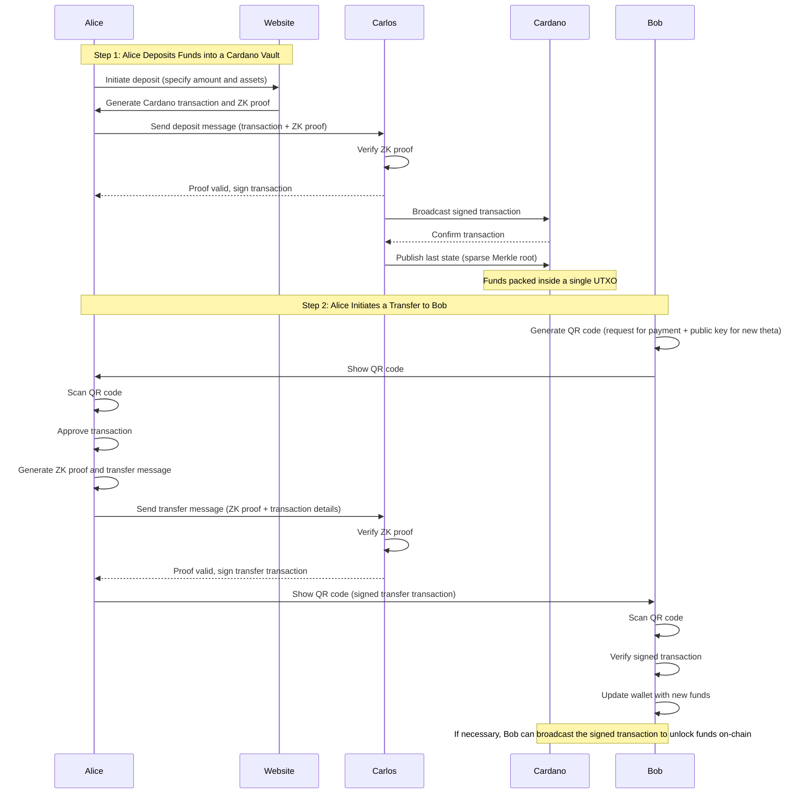

# µgraph: Fast, Untraceable Payments in Cardano

## Table of Contents

1. Abstract
1. Introduction
1. µ and Guardians

## Abstract

In this document, we describe **µgraph (Mugraph)**, a novel open-source protocol for instant, private payments in the Cardano Blockchain. It is similar in spirit to what [Cashu](https://cashu.space/) and [Fedimint](https://fedimint.org) are doing in the Bitcoin World, but leveraging zero-knowledge proofs and the Cardano Blockchain to reduce their reliance on trusted parties. Our goal is to create a platform where non-technical users can reliably use for real-world payments, very similarly to what they can do on current legacy systems, and to have this platform be extremely fast and anonymous by default.

## Introduction

µgraph is our interpretation on how cryptocurrencies could be used to enable real-world payments between people. We think blockchains can be great agents for change, to bring back economic power to the people, but it seems that all the things we do are for ourselves, not for the average Joe.

You can see it easily in the wild, most "real-world" crypto businesses still have to do most or all of their payments in Fiat, and the most proeminent commerce use-cases are usually things related to privacy, like VPNs. For many years now, [Travala](https://travala.com) is probably still the only travel provider selling plane tickets that you can pay using crypto.

ZeroHedge explains this phenomena perfectly, in their article ["What Happened to Bitcoin?"](https://www.zerohedge.com/crypto/what-happened-bitcoin):

> At the same time, new technologies were becoming available that vastly improved the efficiency and availability of exchange in fiat dollars. They included Venmo, Zelle, CashApp, FB payments, and many others besides, in addition to smartphone attachments and iPads that enabled any merchant of any size to process credit cards. These technologies were completely different from Bitcoin because they were permission-based and mediated by financial companies. But to users, they seemed great and their presence in the marketplace crowded out the use case of Bitcoin at the very time that my beloved technology had become an unrecognizable version of itself.

In our point of view, there are five main problems we need to tackle if we want to make crypto widely available for anyone:

1. **Volatility:** Because of their nature as assets (as well as the lack of government price controls), crypto assets are much more volatile than most currencies.
1. **Scalability:** No blockchain today is scalable enough for global payments.
1. **Privacy:** Having to make your own financial identity public just to send a payment is a price that many won't pay.
1. **Ease of Use:** You shouldn't need to read the Bitcoin Paper and watch all of Charles Hoskinson videos just to send and receive payments.

We think that 1 is very well served on the Cardano ecosystem, with Stablecoins like [USDM](https://mehen.io/) or [XSY](https://xsy.fi/), and synthetic assets in platforms like [Butane](https://butane.dev). µgraph then aims to fix the other ones, in a way that guarantees human rights like the right to self-custody of their own wealth, and financial privacy on all layers.

## µ and Guardians

The point of contact for a normal user with the network is by using **µ (Mu)**, a normal application for both iOS and Android. Once the user installs it, they are already inside the network. There is no need to create a wallet, as the device itself is the wallet.

This is a very simple overview of the workflow for a transaction, in which **Alice** deposits money into the system, and sends money to Bob later:

## LICENSE

µgraph (and all related projects inside the organization) is dual licensed under the [MIT](./LICENSE) and [Apache 2.0](./LICENSE.apache2) licenses. You are free to choose which one of the two choose your use-case the best, or please contact me if you need any form of expecial exceptions.
