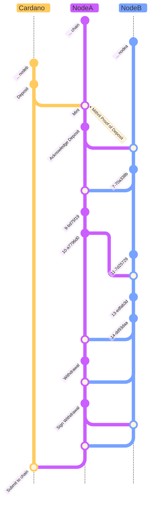
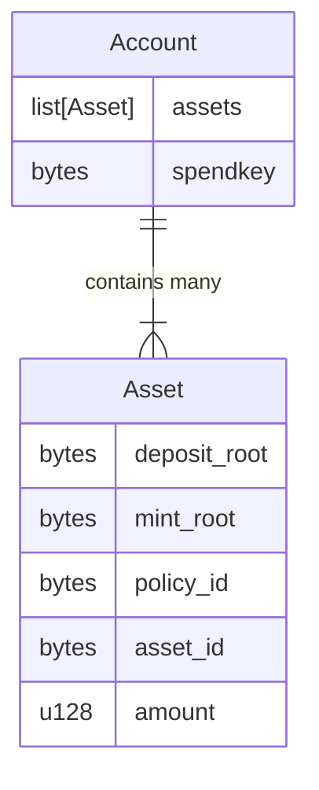
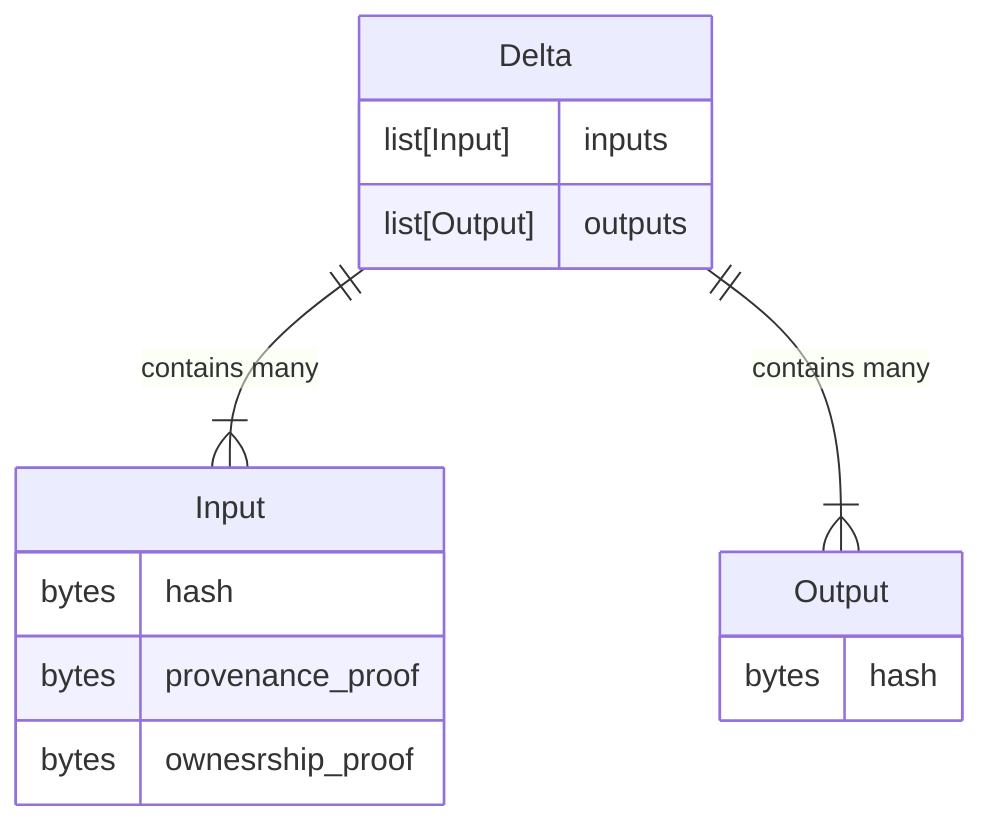
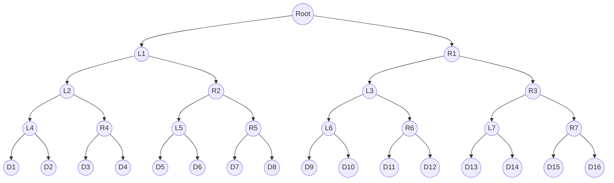
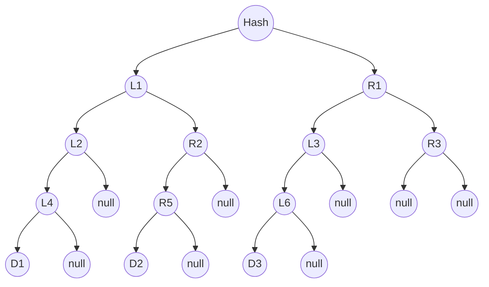
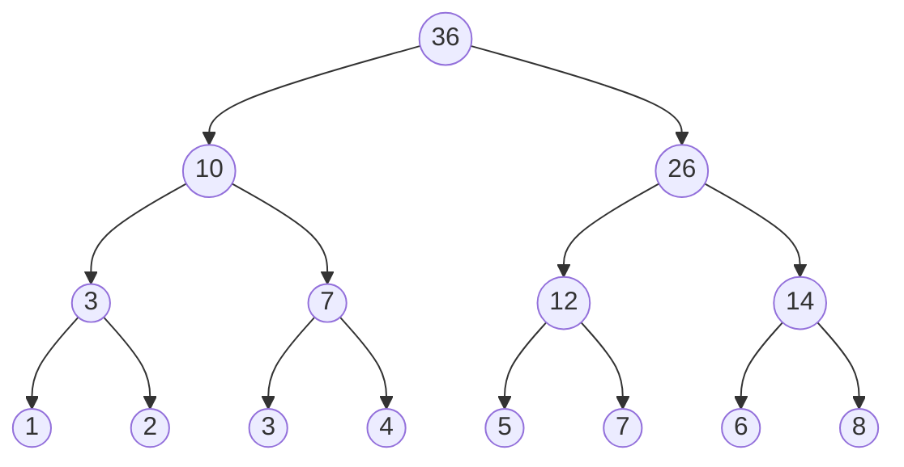
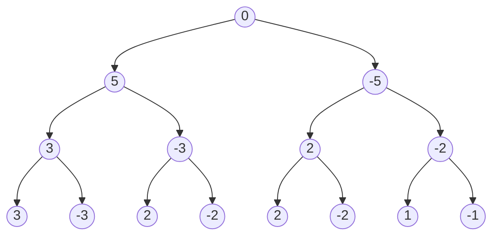
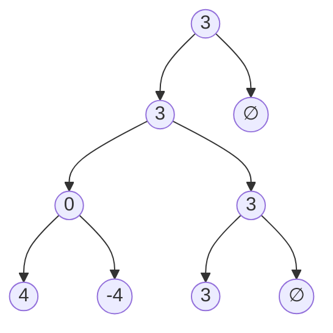

# µgraph

µgraph is a protocol for a Layer 2 for Cardano. It aims to massively scale asset transfers, allowing instant, private payments between users.

It is an intentionally simplified both in operation and capabilities, to fulfill a single use-case: payments. Unlike normal Layer 2s, no assets can be minted inside the network, only Cardano Native Assets can be transacted.

## Goals

Those are the goals, in order:

* Ease of Use
* Privacy by default
* Instant finality
* Programmability

## Definitions

* µtail: a node that holds a Sparkle Sum Merkle Tree for the user balances in the vault
* Galaxy: N µtails, 1 Asset Vault
* Account: A bucket of assets with a spend key, can be burned to redeem assets in the vault
* Asset: triplet (`policy_id`, `asset_id`, `amount`), representing the equivalent asset in the vault
* Delta: A mapping from N Accounts to M accounts, together with block hash (from the chain) and hash of node tree

## Workflow

The µgraph network is made of Galaxies, "consensus groups" that transact the funds in behalf of the users. They are very small, so transactions inside those galaxies are completely instant and free. They are also **blind**, so they don't know who's transacting what with whom.

Each Galaxy is responsible for a Vault, which contains the user funds deposited in them. Nodes in the galaxy can not spend any funds, but they need a threshold confirmation from the nodes (2/3 of the µtails).

The consensus inside these galaxies is massively simplified to increase speed, at a reduced protection against non-byzantine actors, but also reduced strictness requirements.

More nodes increase reliability, but decreases transaction speed slightly. Those nodes are not required to stay online all the time, but they are expect to not do byzantine actions (though the consensus still protects against it).

Unlike Hydra Heads, Galaxies never publish their checkpoints on-chain, only interacting with the main chain if money needs to be deposited or withdrawn from the Vault.

Their responsibility, instead, is to track the causality between events, propagate those messages between the other µtails in the galaxy, and verify zero-knowledge proofs.

### System Messages

Those are the messages that can be sent by users:

#### Deposits

Deposits to the vault are permissionless, and can be done by anyone, and works in a "Two-Phase Commit", that works like this:

1. The user deposits the funds to the vault, and wait for the transaction to be confirmed.
2. The user generates a proof based on **Mithril Certified Transactions**, proving the transaction has been commited on chain and that the user owns the funds that have been deposited.
3. The user "mints" an Account on-chain with the funds they deposited.

#### Withdrawals

Withdrawals follows a very similar process:

1. The user sends a "burn" message to the galaxy, together with a Cardano transaction and a list of accounts.
2. Nodes sign the transaction as they propagate the event.
3. User submits transaction to the blockchain.

#### Transactions

And for transactions:

1. The user sends a proof of the transaction, that proving that no value has been created or destroyed ($tx_\text{in} - tx_\text{out}$ must equal $0$).
2. Nodes sign the proof as they propagate the event.
3. Once the aggregated signature has reached the threshold, the transaction is commited.

### Gossip

µgraph uses a very, very simple gossip model:

First, here's how we track membership:

1. Nodes register to the galaxy by interacting with a smart contract.
2. They receive a NFT, which contains their IP in the metadata.
3. Nodes query the chain every few blocks to find new nodes.

And here's what happens when we receive a new message:

1. Have we seen the message before?
  - If yes, respond with all signatures collected for this message.
  - If not, sign message, then propagate.
2. To propagate the message:
  - Choose random Node in Galaxy
  - Merge the node Merkle Tree with the other node Merkle Tree
  - Accumulate unseen signatures
  - Propagate again if to another random node if any new message is seen.
3. Start at the latest round when node joined the network
4. Increase round number when new Mithril (deposit/withdrawal) proof is seen

This graph shows in a very simplified way how the messages are propagated in the system. The yellow line represents the chain itself, and merges in and out of the yellow lines are withdrawals and deposits, respectively.

## Account

An **Account** is a file, or a document that stays at the user device. It is, conceptually, a mixture between a UTXO and a normal Wallet.

Accounts contain multiple assets, which represent Cardano Native Assets in the blockchain, together with a `spendkey`, which when revealed "burns" the account so it can not be used again.

A Delta (transaction) then looks like this:

## µtails

µtails, or the nodes inside a galaxy, receive transactions, deposits and withdraw from users, propagate those to other nodes inside the same galaxy, and maintain a **Causality Graph** of all the events in the system.

This causality graph encodes the binary relationship $\leq$ between each event in the system, or in other words, what event happened before the other.

The causality graph is built of two structures, a **Merkle Search Tree** of **Zero Trees**, and a **Hash Graph**.

### Zero Tree

This is what a Merkle Tree usually looks like:

For a Sparse Merkle Tree, instead, the right leaf can be null, and nulls have a single, known hash:

What this means for us is that we can keep "partial snapshots" of the tree, and only needing to share the first level of the tree publically, massively reducing the size of what is shared between users.

#### Merkle Sum Trees

A **Merkle Sum Tree** is a variant of a Merkle tree in which each node contains a value, and this value needs to be taken into consideration when generating the hash.

The benefit of this is that the tree itself guarantees that no value is created and no value is destroyed as new items are appended to it.

#### Zero Sum Trees, Finally

A **Zero Sum Tree**, then, is a Sparse Merkle Sum Tree that, when complete, has a total sum of 0.

When incomplete, however, the root of the tree indicates the total amount that has not been **spent**:

## License

µgraph (and all related projects inside the organization) is dual licensed under the [MIT](./LICENSE) and [Apache 2.0](./LICENSE.apache2) licenses. You are free to choose which one of the two choose your use-case the best, or please contact me if you need any form of expecial exceptions.

## Contributing Guidelines

All contributions are welcome, as long as they align with the goal of the project. If you are not sure whether or not what you want to implement is aligned with the goals of the project, just ask!

Don't be an asshole to anyone inside and out of the project and you'll be fine.
