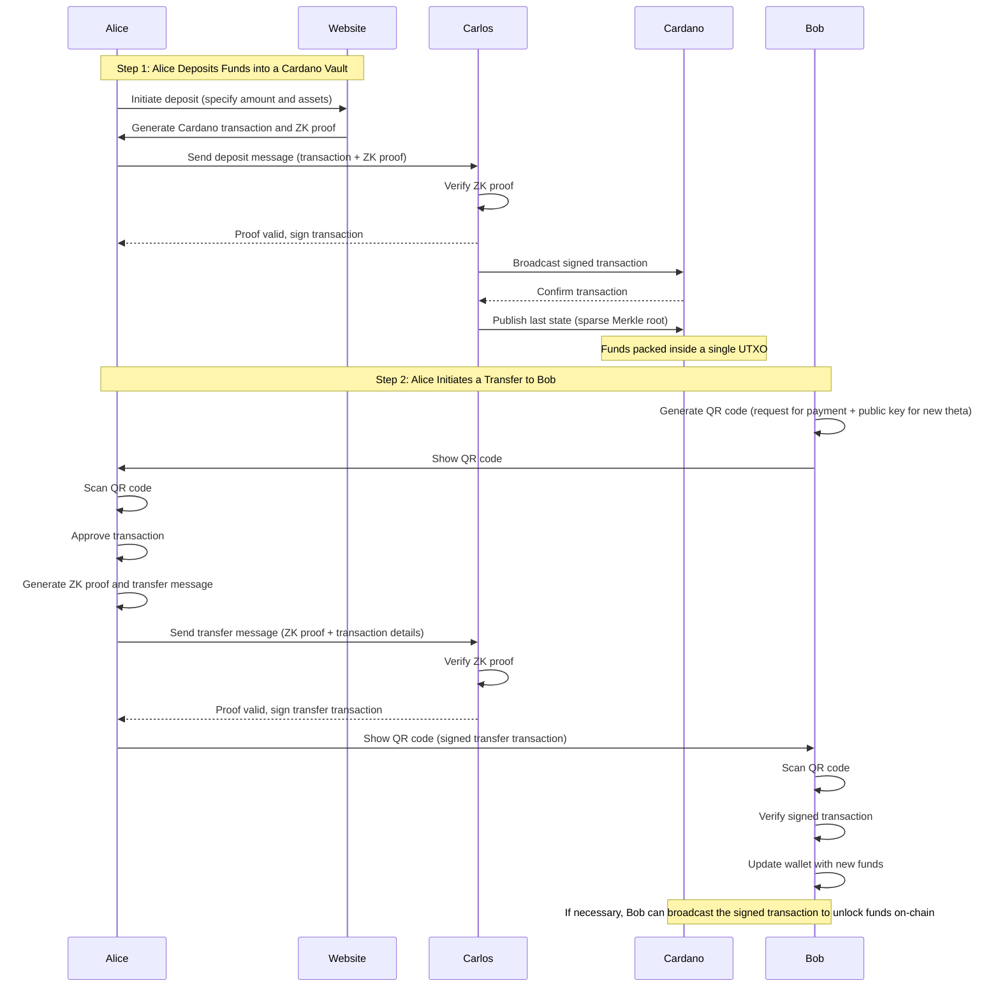

# µgraph: Fast, Untraceable Payments in Cardano

## Table of Contents

1. Abstract
1. Introduction
1. µ
1. License

## Abstract

In this document, we describe **µgraph (mugraph)**, a novel open-source protocol for instant, private payments in the cardano blockchain. it is similar in spirit to what [cashu](https://cashu.space/) and [fedimint](https://fedimint.org) are doing in the bitcoin world, but leveraging zero-knowledge proofs and the cardano blockchain to reduce their reliance on trusted parties. our goal is to create a platform where non-technical users can reliably use for real-world payments, very similarly to what they can do on current legacy systems, and to have this platform be extremely fast and anonymous by default.

## Introduction

µgraph is our interpretation on how cryptocurrencies could be used to enable real-world payments between people. We think blockchains can be great agents for change, to bring back economic power to the people, but it seems that all the things we do are for ourselves, not for the average Joe.

You can see it easily in the wild, most "real-world" crypto businesses still have to do most or all of their payments in Fiat, and the most proeminent commerce use-cases are usually things related to privacy, like VPNs. For many years now, [Travala](https://travala.com) is probably still the only travel provider selling plane tickets that you can pay using crypto.

ZeroHedge explains this phenomena perfectly, in their article ["What Happened to Bitcoin?"](https://www.zerohedge.com/crypto/what-happened-bitcoin):

> At the same time, new technologies were becoming available that vastly improved the efficiency and availability of exchange in fiat dollars. They included Venmo, Zelle, CashApp, FB payments, and many others besides, in addition to smartphone attachments and iPads that enabled any merchant of any size to process credit cards. These technologies were completely different from Bitcoin because they were permission-based and mediated by financial companies. But to users, they seemed great and their presence in the marketplace crowded out the use case of Bitcoin at the very time that my beloved technology had become an unrecognizable version of itself.

In our point of view, there are five main problems we need to tackle if we want to make crypto widely available for anyone:

1. **Volatility:** Because of their nature as assets (as well as the lack of government price controls), crypto assets are much more volatile than most currencies.
1. **Scalability:** No blockchain today is scalable enough for global payments.
1. **Privacy:** Having to make your own financial identity public just to send a payment is a price that many won't pay.
1. **Ease of Use:** You shouldn't need to read the Bitcoin Paper and watch all of Charles Hoskinson videos just to send and receive payments.

We think that, while there has been at least some very solid attempts at covering volatility and scalability, there are still lots of work to be done to make it a proper global payment network. This is our attempt to tackle them, in a way that guarantees human rights like the right to self-custody of their own wealth, and financial privacy on all layers.

## Technical Overview

So those are the goals for µgraph:

- **It must be anonymous**, because it is paramount to us to safeguard users' financial privacy.
- **It must be fully custodial**, meaning that users should never lose control of their funds.
- **It must be easy to use**, else it won't be good enough to embrace the globe.

In a way, it works in a similar way to the [Lightning Network](https://lightning.network) (on Bitcoin) and [Hydra](https://hydra.family) (on Cardano). Both are solutions allowing for instant settlement of transactions, by locking funds inside a off-chain structure (a "Channel"), in which these funds can be transacted directly, off-chain.

Transacting those funds is a very complicated process, and so is opening, closing, and maintaining those channels. Most people decide to instead use a custodial solution, like [Wallet of Satoshi](https://www.walletofsatoshi.com/) or [Alby](https://getalby.com), trading their self-custody to get an usable experience in the network.

Given our stated goals, there are some concepts that are important to us:

### Chaumian eCash

In 1982, David Chaum created **ECash**, which introduced the concept of a **Blind Signer**. A Blind Signer, as the name might suggest, is an entity that signs messages without knowing either the author, nor the contents of the message.

In ECash, those blind signers are called **Chaumian Mints**, and they create IOUs ("I-owe-you"), a kind of contract that states *"I owe X to a person with the possession of this message"*. Because these contracts are created by the Mint itself, it can verify their authenticity, only honoring real contracts. And because it is a blind signer, it can not connect the depositor to the redeemer in any way, as those contracts are indistinguishable from each other.

ECash gives us the framework to guarantee anonimity, but requires centralized Mints, solely responsible for holding the user funds.

### Cardano Smart Contracts

In the Lightning Network, channels are implemented using **Hash Time Locked Contracts**, which are "contracts" that require some conditions to be upheld before allowing a transaction to be considered value, namely the knowledge of a secret value, and at least a certain amount of time has passed, in blocks.

Because we are building µgraph in Cardano, we have access to two kinds of "smart contracts" that we can use, [Cardano Native Scripts](<>) and Plutus Scripts

### Zero-Knowledge Proofs

Without going too technical for now, Zero-Knowledge Proofs, or ZK-Proofs, are a cryptographic mechanism in which one party (the prover) can prove to another party (the verifier) that a statement is true, without revealing any more information than this.

## License

µgraph (and all related projects inside the organization) is dual licensed under the [MIT](./LICENSE) and [Apache 2.0](./LICENSE.apache2) licenses. You are free to choose which one of the two choose your use-case the best, or please contact me if you need any form of expecial exceptions.

## Contributing Guidelines

All contributions are welcome, as long as they align with the goal of the project. If you are not sure whether or not what you want to implement is aligned with the goals of the project, just ask!

Don't be an asshole to anyone inside and out of the project and you'll be fine.
