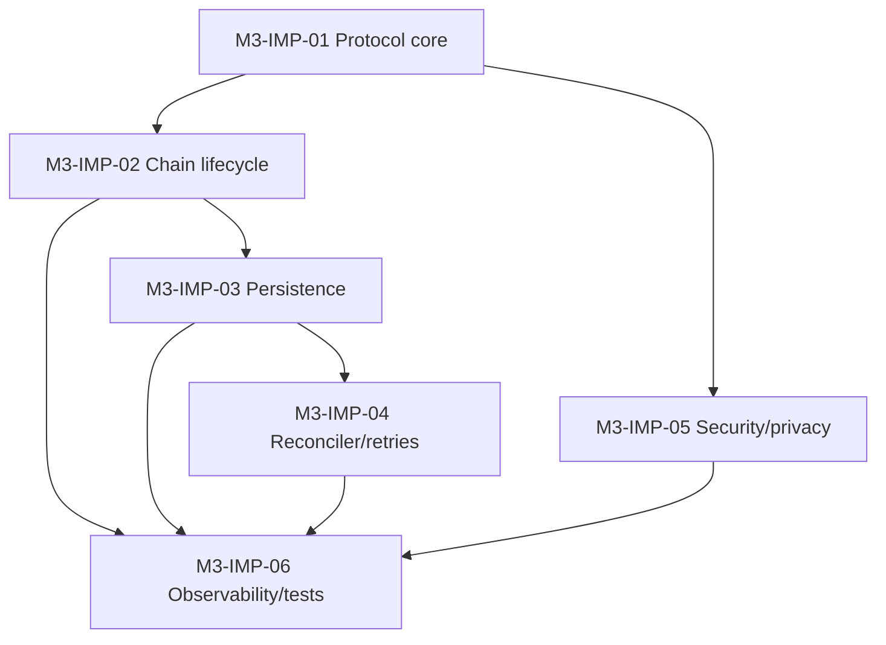

# Milestone 3 — Implementation Backlog (Simplified)

Status: Draft
Owner: RedUnion
Last updated: 2026-02-26

## 1) Guiding principles

1. Chain-authoritative settlement.
2. Minimal inter-node protocol.
3. ACK is optimization, not truth.
4. Deterministic reconciliation over complex branching.
5. Design and implement on-chain and off-chain lanes explicitly.

## 2) Work items

## M3-IMP-01 — Protocol core

Implement canonical envelope + minimal wire messages.

Scope:
- `transfer_init`, `transfer_notice`, `transfer_status_query`, `transfer_status`
- optional `transfer_ack`
- version/signature/replay/idempotency validation

Done when:
- deterministic validation errors
- stable serialization tags
- duplicate-safe handling

## M3-IMP-02 — Chain-driven lifecycle

Implement reduced source/destination lifecycle with explicit on-chain and off-chain lanes, and chain-gated credit/finality.

Done when:
- no ack-only finalization
- no stale-ack regression
- off-chain success cannot finalize without chain confirmation
- deterministic invalidated path on deep reorg

## M3-IMP-03 — Persistence + migration

Implement v3 schema and migration.

Scope:
- `CROSS_NODE_TRANSFERS` (authoritative)
- `CROSS_NODE_MESSAGES` (dedupe/diagnostic)
- `IDEMPOTENCY_KEYS`
- `TRANSFER_AUDIT_LOG`

Done when:
- transactional migration
- atomic transition+idempotency+audit commit
- restart-safe convergence

## M3-IMP-04 — Retry/reconciler workers

Implement bounded retries and chain-first reconciliation.

Done when:
- lost ACK does not block success
- retry exhaustion reaches explicit manual review path

## M3-IMP-05 — Security/privacy controls

Implement mandatory `M3-SEC-*` controls.

Done when:
- spoof/replay/idempotency-conflict paths reject deterministically
- logs redact sensitive fields

## M3-IMP-06 — Observability/tests/CI gates

Implement `M3-OBS-*` telemetry and automated gates.

Done when:
- `M3-OBS-01..08` pass in CI
- mixed-version + failure-recovery scenarios pass

## 3) Dependency order

## 4) Release checklist

- [ ] chain-authoritative lifecycle verified
- [ ] duplicate/replay/stale-ack invariants proven
- [ ] reorg invalidation/recovery validated
- [ ] `M3-SEC-*` requirements passing
- [ ] `M3-OBS-*` requirements passing
- [ ] runbooks/docs updated with final defaults
