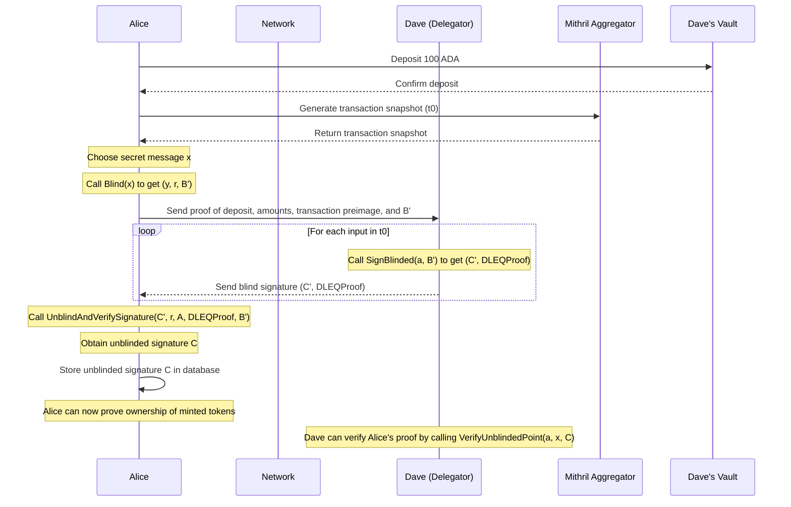

# Workflow

## Assumptions

- Mithril aggregators generate non-repudiable proofs that a transaction has been included in a valid block with sufficient stake validation.
- All Vaults initialize with a default balance of Zero.
- All hash functions utilize Blake2B-256.
- All cryptographic operations are performed using the Ristretto25519 curve.

## Participants

- Alice: A user in the system
- Bob: A user in the system
- Charles: A user in the system
- Dave: A delegator in the network (acts as the signer or "mint" in the BDHKE protocol)

## Variables and Functions

1. $G$: Generator point of an elliptic curve (set as the Ristretto curve basepoint)
1. $d$: Dave's Delegator Node
1. $d_v$: Smart Contract Vault held by Dave
1. $m_a$: Mithril Aggregator for the chosen Network
1. $\text{Blind}(m) \rightarrow (y, r, B')$

   This function blinds a secret message $m$:
   
   - Compute $y = f_\text{htc}(m)$, where $f_\text{htc}$ is a hash-to-curve function
   - Generate a random scalar $r$
   - Compute $B' = y + G \cdot r$
   - Return the tuple $(y, r, B')$

1. $\text{SignBlinded}(sk, B') \rightarrow (C', \pi_\text{DLEQ})$

   This function signs a blinded point and generates a Discrete Logarithm Equality (DLEQ) proof:
   
   - Compute $C' = B' \cdot sk$
   - Compute $pk = G \cdot sk$
   - Generate DLEQ proof $\pi_\text{DLEQ}$:
     - Generate a random scalar $k$
     - Compute $R_1 = G \cdot k$
     - Compute $R_2 = B' \cdot k$
     - Compute $e = \mathcal{H}(R_1, R_2, pk, C')$
     - Compute $s = k + e \cdot sk$
   - Return the tuple $(C', \pi_\text{DLEQ}(e, s))$

1. $\text{VerifyDLEQProof}(pk, B', C', \pi_\text{DLEQ}) \rightarrow \{0, 1\}$

   This function verifies a DLEQ proof:
   
   - Compute $R_1 = G \cdot s - pk \cdot e$
   - Compute $R_2 = B' \cdot s - C' \cdot e$
   - Compute $e' = \mathcal{H}(R_1, R_2, pk, C')$
   - Return 1 if $e = e'$, 0 otherwise

1. $\text{UnblindAndVerifySignature}(C', r, pk, \pi_\text{DLEQ}, B') \rightarrow C \text{ or } \perp$

   This function unblinds and verifies a signature:
   
   - If $\text{VerifyDLEQProof}(pk, B', C', \pi_\text{DLEQ}) = 1$:
     - Compute and return $C = C' - pk \cdot r$
   - Otherwise, return $\perp$

1. $\text{VerifyUnblindedPoint}(sk, m, C) \rightarrow \{0, 1\}$

   This function verifies an unblinded point:
   
   - Compute $y = f_\text{htc}(m)$
   - Return 1 if $y \cdot sk = C$, 0 otherwise

1. $\text{SchnorrSign}(sk, m) \rightarrow (R, s)$

   This function signs a message $m$ using private key $sk$:
   
   - Generate a random scalar $k$
   - Compute $R = G \cdot k$, where $G$ is the Ristretto basepoint
   - Compute $e = \mathcal{H}(R, m)$, where $\mathcal{H}$ is a hash-to-scalar function
   - Compute $s = k + e \cdot sk$
   - Return the signature $(R, s)$

1. $\text{SchnorrVerify}(pk, (R, s), m) \rightarrow \{0, 1\}$

   This function verifies a Schnorr signature $(R, s)$ on message $m$ using public key $pk$:
   
   - Compute $e = \mathcal{H}(R, m)$
   - Compute $LHS = G \cdot s$
   - Compute $RHS = R + pk \cdot e$
   - Return 1 if $LHS = RHS$, 0 otherwise

12. $\text{CreateAggregatedAssetCommitment}(a, v, b) \rightarrow AggregatedAssetCommitment$

    This function creates an aggregated asset commitment using a single Bulletproof:
    
    - Initialize a Merlin transcript for the commitment
    - For each $(a_i, v_i, b_i)$:
      - Compute $h_i = \text{hash to curve}(a_i)$
      - Compute $C_i = v_i \cdot G + b_i \cdot H + h_i$
      - Append $a_i$ and $C_i$ to the transcript
    - Create a single 64-bit Bulletproof for all $v$ using $b$ as the blinding factors
    - Return $AggregatedAssetCommitment(bulletproof, \{C_i\}, \{a_i\})$

    Where:
    - $a$ are asset ids (32-byte Hashes)
    - $v$ are amounts
    - $b$ are blinding factors
    - $bulletproof$ is a RangeProof
    - $\{C_i\}$ are CompressedRistretto points

13. $\text{VerifyAggregatedAssetCommitment}(c) \rightarrow \{0, 1\}$

    This function verifies an aggregated asset commitment:
    
    - Verify the Bulletproof for all amounts
    - For each $(C_i, a_i)$ in the commitment $c$:
      - Compute $h_i = \text{hash to curve}(a_i)$
      - Verify that $C_i$ is a valid point on the curve (not the identity point)
      - Verify that $C_i \neq h_i$ (ensures the commitment includes some amount and/or blinding factor)
    - Return 1 if all verifications succeed, 0 otherwise

14. $\text{CheckBalance}(i, o) \rightarrow \{0, 1\}$

    This function checks the balance of inputs and outputs:
    
    - Initialize a HashMap to track balances for each asset type
    - For each input commitment in $i$:
      - Add the commitment to the balance of its asset type
    - For each output commitment in $o$:
      - Subtract the commitment from the balance of its asset type
    - Verify that the final balance for each asset type is the identity point (representing zero)
    - Return 1 if all asset types balance, 0 otherwise

## Workflows

### Setting Up a Delegator

1. Dave generates a private key $a$ and computes the public key $A = G \cdot a$.

1. Dave sends a transaction to the network, including:
   - A list of active valid keys for the delegator set (currently ${A}$)
   - A list of expired keys for the delegator set (currently empty)
   - $G$: the generator point of the elliptic curve

1. Dave creates the vault $d_v$ on the network.

### Minting Tokens

1. Alice deposits 100 ADA into $d_v$.

1. Upon confirmation, Alice generates a transaction snapshot for her transaction $t_0$ at $m_a$.

1. Alice prepares for the BDHKE protocol:
   - Choose a secret message $x$ (for example, transaction details).
   - Call $\text{Blind}(x)$ to obtain $(y, r, B')$.

1. Alice sends proof of deposit with amounts, transaction preimage, and $B'$ to $d$.

1. Dave (the delegator) responds:
   - Call $\text{SignBlinded}(a, B')$ to obtain $(C', \text{DLEQProof})$.
   - Send the blind signature $(C', \text{DLEQProof})$ for each input in $t_0$.

1. Alice unblind-verifies the signature:
   - Call $\text{UnblindAndVerifySignature}(C', r, A, \text{DLEQProof}, B')$ to obtain $C$.
   - If $C$ is None, the verification failed.
   - Otherwise, Alice has the unblinded signature $C$.

1. Alice stores the unblinded signature $C$ in her database.

1. Alice can later prove ownership of the minted tokens by demonstrating knowledge of $x$ and $C$.

1. Dave can verify Alice's proof by calling $\text{VerifyUnblindedPoint}(a, x, C)$.

### Swapping Tokens

1. Define asset types $\{A_1, A_2, ..., A_k\}$.

2. Alice prepares input amounts $\{a_{1,j}, a_{2,j}, ..., a_{n,j}\}$ for each asset type $j$.

3. Alice generates output amounts $\{b_{1,j}, b_{2,j}, ..., b_{m,j}\}$ for each asset type $j$.

4. Alice creates a single aggregated asset commitment for all inputs and outputs:
   - Generate random blinding factors $r_{i,j}$ for inputs and $s_{i,j}$ for outputs
   - Call $\text{CreateAggregatedAssetCommitment}(\{A_j\}, \{a_{i,j}\} \cup \{b_{i,j}\}, \{r_{i,j}\} \cup \{s_{i,j}\})$ to obtain $C_{agg}$

5. Alice generates output secret messages $x_1, x_2, ..., x_m$ corresponding to the output amounts.

6. Alice blinds each output secret message:
   - Call $\text{Blind}(x_i)$ to obtain $(y_i, t_i, B'_i)$

7. Alice sends to Dave:
   - Input proofs: $\{P_1, P_2, ..., P_n\}$ (proofs of ownership for input amounts)
   - Aggregated asset commitment: $C_{agg}$
   - Blinded output points: $\{B'_1, B'_2, ..., B'_m\}$

8. Dave verifies:
   - Validity of input proofs $P_1, ..., P_n$
   - Aggregated asset commitment using $\text{VerifyAggregatedAssetCommitment}$
   - That the sum of input amounts equals the sum of output amounts for each asset type (this is implicitly verified by the structure of the aggregated commitment)

9. If verified, Dave blind signs each $B'_i$.

10. Alice unblinds and verifies signatures, obtaining new proofs $\{(x_1, C_1), ..., (x_m, C_m)\}$.

11. Alice stores new proofs; system invalidates original input proofs.

### Creating and Verifying Aggregated Asset Commitments

1. To create an aggregated asset commitment for multiple asset types and amounts:
   - For each asset type $A_i$ and amount $v_i$:
     - Generate a random blinding factor $r_i$
   - Call $\text{CreateAggregatedAssetCommitment}(\{A_i\}, \{v_i\}, \{r_i\})$ to obtain $C_{agg}$
   - The function internally creates individual commitments and a single Bulletproof for all amounts

2. To verify an aggregated asset commitment:
   - Receive the aggregated asset commitment $C_{agg}$
   - Call $\text{VerifyAggregatedAssetCommitment}(C_{agg})$
   - The function verifies the Bulletproof and checks each commitment's structure

3. To check the balance in a transaction:
   - Collect all input commitments $\{C_{in}\}$ and output commitments $\{C_{out}\}$
   - Call $\text{CheckBalance}(\{C_{in}\}, \{C_{out}\})$
   - The function ensures that for each asset type, inputs equal outputs

### Receiving Swapped Tokens

When Carol receives Proofs from Alice, she can perform a similar swap operation to obtain new Proofs:

1. Carol receives Proofs $\{(x_1, C_1), (x_2, C_2), ..., (x_k, C_k)\}$ from Alice.

1. Carol generates new secret messages $z_1, z_2, ..., z_l$ for her desired output tokens.

1. Carol performs steps 3-11 as described above, using the received Proofs as inputs.

1. After the swap, Carol has new Proofs that only she can spend, and the Proofs received from Alice are invalidated.

### Burning Tokens to Redeem ADA

[This section is yet to be completed.]